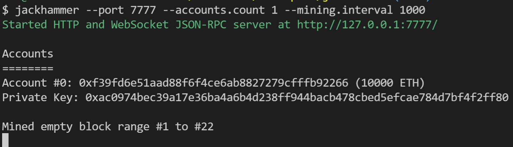

# Jackhammer

Run a Hardhat Network node from the command line! 

<br/>
<br/>

<p align="center">
  
</p>

<br/>
<br/>

### Install

```
$ npm install jackhammer -g
```

### Example

```
$ jackhammer --port 7777 --accounts.count 1 --mining.interval 1000
```

<p align="left">
  
</p>

### Parameters

All parameters are derived from the configuration values in the [Hardhat Network Reference](https://hardhat.org/hardhat-network/reference/#config). To turn a configuration option into a parameter, simply use the format `--<configuration name> value`. For nested parameters, like an account mnemonic, use the `.` separator to signal nesting. e.g., `--accounts.mnemonic "essay portion ... churn service"`. 

Jackhammer also accepts two parameters not in the Hardhat Network Reference: `--port` and `--hostname`. These work exactly the same way as they do when running `hardhat node`. 

### Bonus! 

Jackhammer provides a handy `jh` shortcut command along with `jackhammer` for those of you that like shortcuts. Happy day! 

```
$ jh --port 7777
Started HTTP and WebSocket JSON-RPC server at http://127.0.0.1:7777/
// ...
```

### Contributions

Sure! 